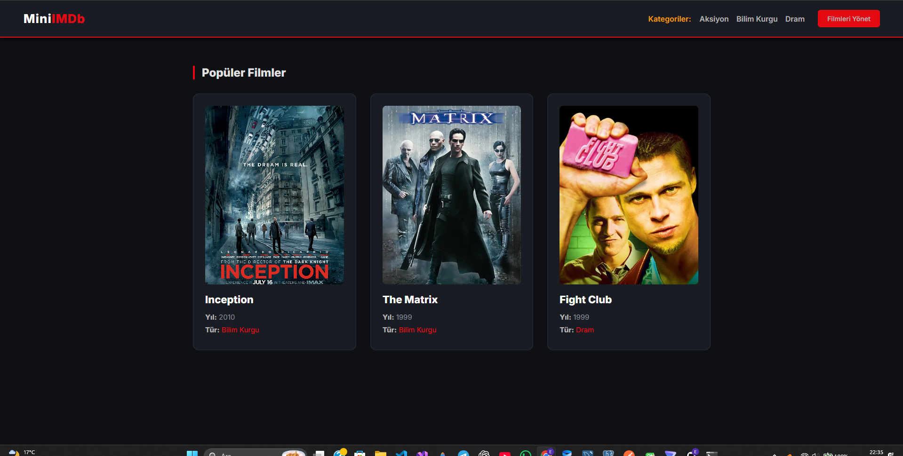
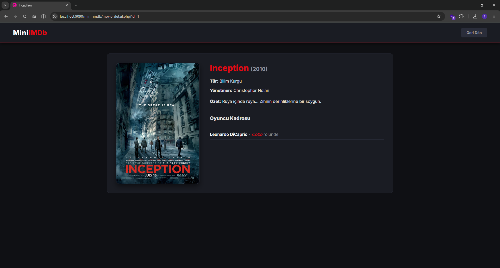
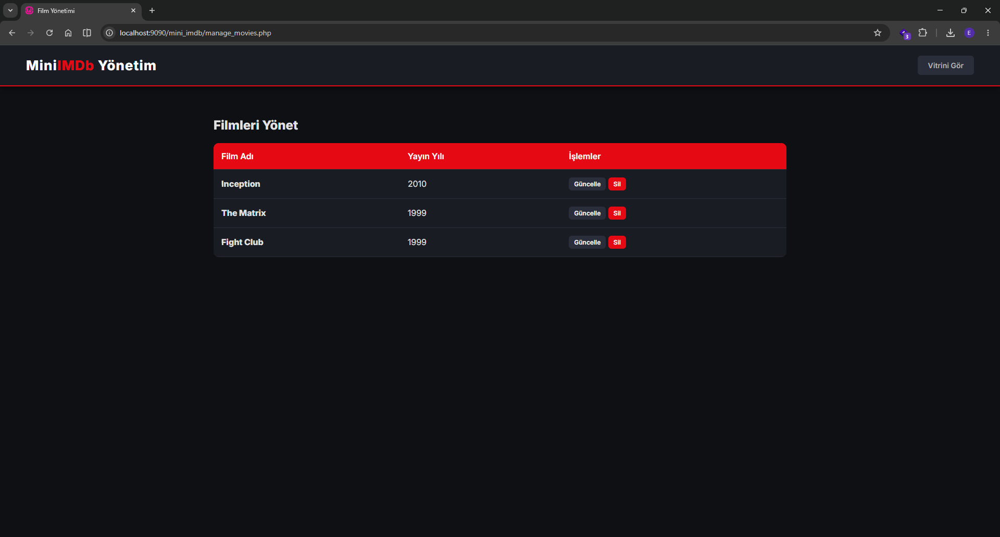
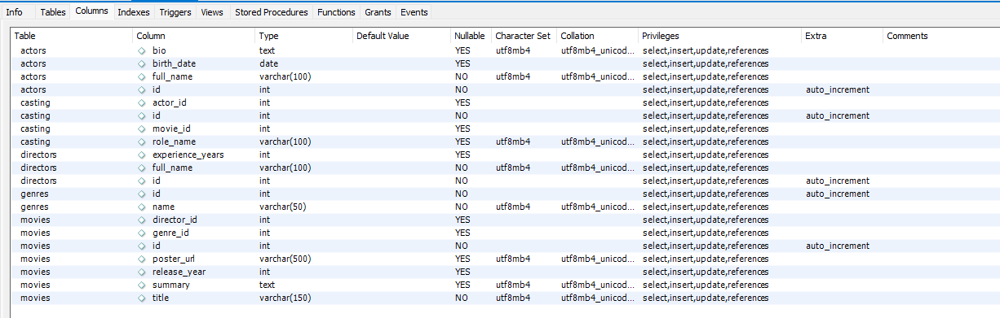

# Mini IMDb - Film ve Oyuncu Veritabanı (PHP Modülü)

Bu proje, web programlama mimarilerini karşılaştırmalı olarak incelemek amacıyla hazırlanan "Üç Dil (PHP, JSP, ASP) Ödevi"nin **PHP** kullanılarak geliştirilen ilk aşamasıdır. Temel olarak ilişkisel veritabanı mantığı (MySQL) ile dinamik web sayfaları oluşturmayı, CRUD işlemlerini ve tablo birleştirme (JOIN) yapılarını pratik etmeyi amaçlamaktadır.

## Proje Özellikleri

* **Film Vitrini:** Veritabanındaki tüm filmlerin afişleri, yayın yılları ve türleriyle birlikte şık kartlar halinde listelendiği ana sayfa.
* **Film Detay Ekranı:** Seçilen filmin özetini, yönetmenini ve oyuncu kadrosunu (MySQL JOIN işlemleri ile) gösteren detay sayfası.
* **Oyuncu Profili:** Oyuncuların biyografisi, doğum tarihi ve kariyeri boyunca oynadığı filmlerin dinamik listesi.
* **Kategori Filtreleme:** Filmleri Aksiyon, Bilim Kurgu, Dram gibi türlerine göre dinamik menü üzerinden listeleme.
* **Film Yönetimi (CRUD):** Mevcut filmleri veritabanından silme veya temel bilgilerini form üzerinden güncelleme işlemleri.
* **Modern Arayüz:** Saf CSS kullanılarak kodlanmış, karanlık tema (Dark Mode) ağırlıklı, modern ve duyarlı tasarım.

## Kullanılan Teknolojiler

* **Backend:** PHP 8.x (Veritabanı bağlantısı için PDO kullanılmıştır)
* **Veritabanı:** MySQL (WAMP Server kullanılarak yapılandırılmıştır)
* **Frontend:** HTML5, CSS3

## Ekran Görüntüleri

Projenin çalışır halini ve arayüz tasarımını gösteren ekran görüntüleri:

* Ana Sayfa (Film Vitrini)

* Film Detay ve Kadro Sayfası

* Kategori Filtreleme ve Yönetim Paneli

* Veri Tabanı Tabloları

## Kurulum ve Çalıştırma

1. Bu repoyu bilgisayarınıza klonlayın veya zip olarak indirin.
2. `PHP` klasörünün içindeki tüm proje dosyalarını WAMP Server kullanıyorsanız `C:\wamp64\www\mini_imdb` dizinine kopyalayın.
3. WAMP Server üzerinden Apache ve MySQL servislerini başlatın.
4. Veritabanı bağlantısının başarılı olması için kullandığınız MySQL uygulamasında `mini_imdb` adında bir veritabanı oluşturun ve gerekli tabloları (movies, actors, genres vb.) yapılandırın.
5. `db.php` dosyasındaki veritabanı şifre/port ayarlarını kendi yerel sunucunuza göre güncelleyin.
6. Tarayıcınızdan `http://localhost/mini_imdb/index.php` adresine giderek projeyi çalıştırın.
